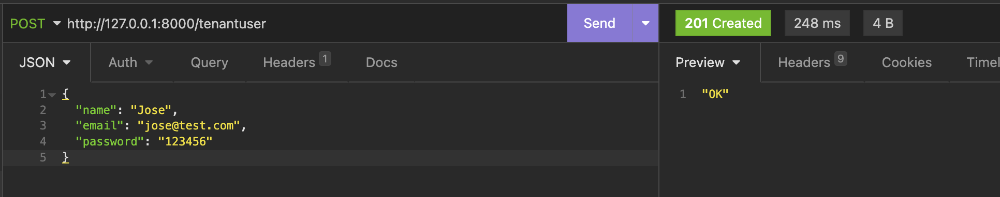
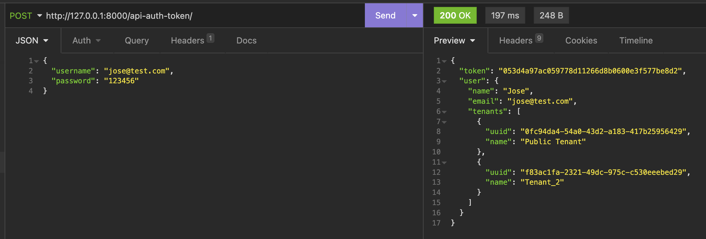
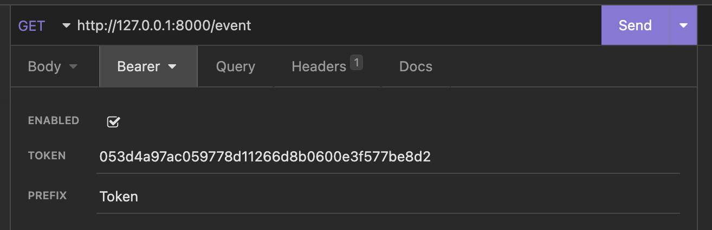
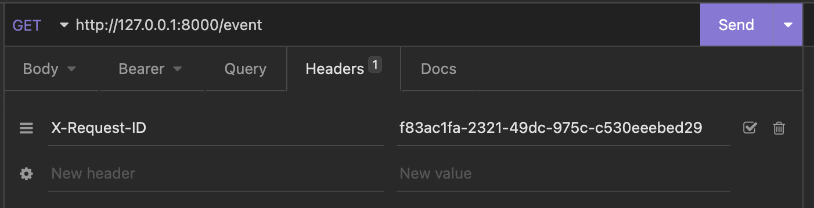
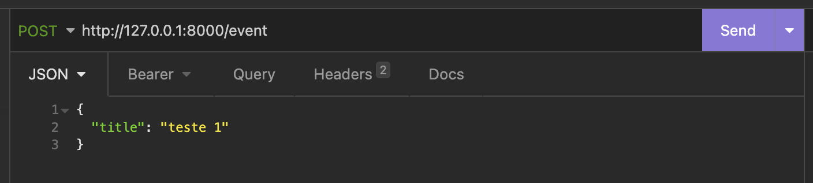
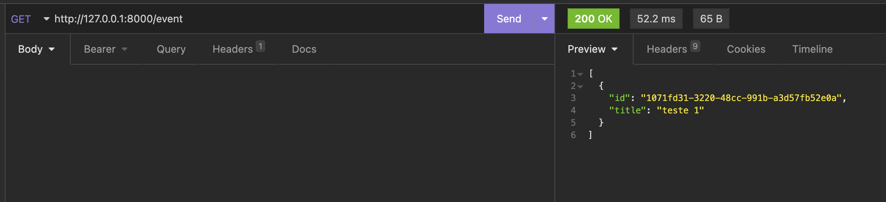

# Instruções

- Criando um container com o Postgres \
  `docker-compose up -d`

- Crie o database (tenant_db) que está no settings.py da forma que preferir \

- Instale as dependências \
  `pip install -r requirements.txt --use-pep517`

- Aplique as migrações \
  `python manage.py migrate_schemas`

- Colete os arquivos estáticos \
  `python manage.py collectstatic`

- Crie o tenant público \
  `python manage.py public_tenant`

- Execute o servidor (É possivel acessar o admin com o usuário: superuser@test.com e senha: admin) \
  `python manage.py runserver`

- Para criar usuários através da API: \
  

- A atribuição de tenants diferentes do público não está implementada. Para isso criei o método: \
  `python manage.py tenant "Tenant_XYZ" "jose@test.com" "123456"`

- Para obter um token e os ids dos tenants do usuário: \
  

- Para utilizar um app através dos tenants diferentes basta informar o token e o id do tenant ao fazer os requests: \
  
  
  
  
